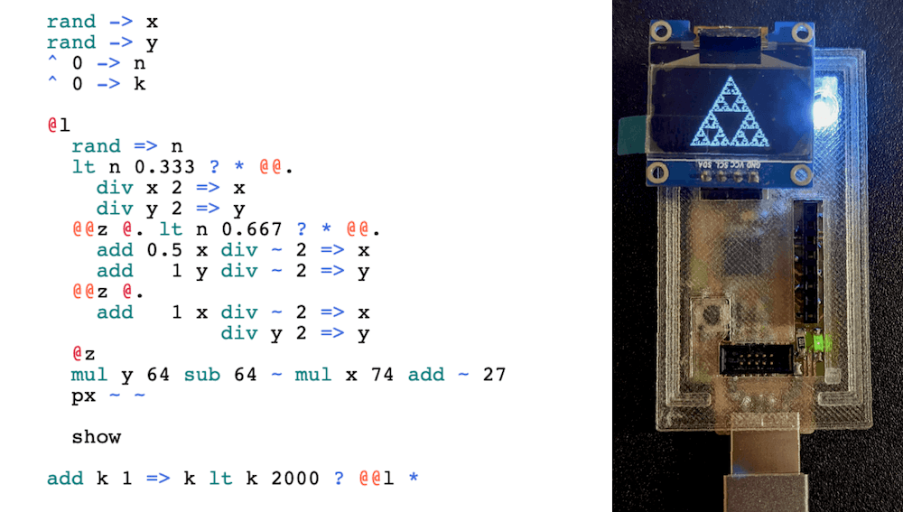
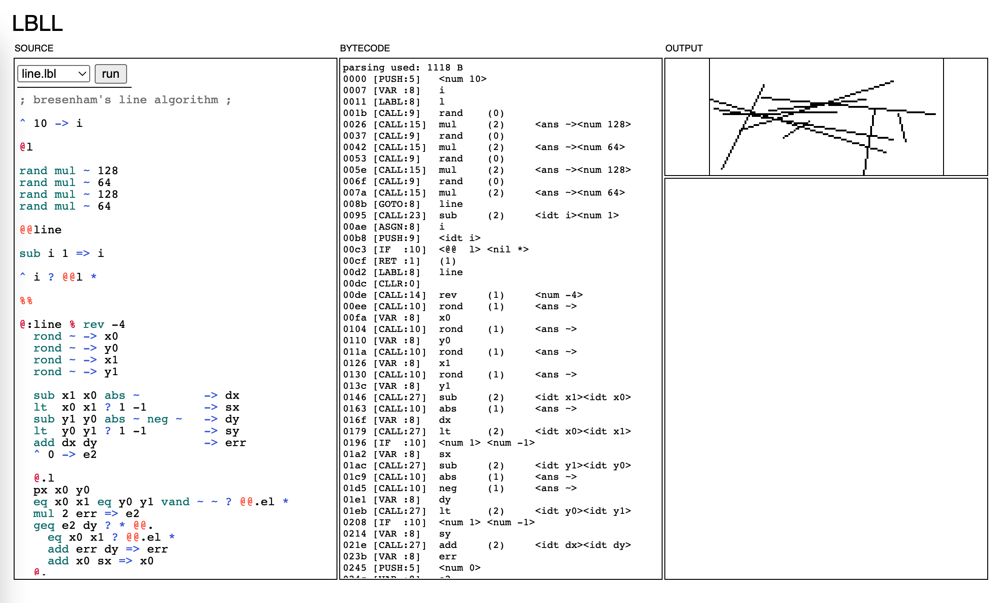

# LBLL

**l**ingdong's **b**ad **l**anguage (with **l**abels!)

lbll is a tiny experimental language for limited environments. The project's intention is to make an interpreter with minimal binary size and minimal memory usage, while having a syntax somewhat enjoyable to use for the programmer and creating illusions of higher-level constructs. I use it to script my microcontrollers. It also works on a regular computer (obviously) and in the browser.

Here's the classic Sierpinski's triangle example, and an image of the program running on an [ATSAMD21E18A](https://www.microchip.com/en-us/product/ATSAMD21E18):




lbll borrows ideas from PostScript and assembly languages. It is stack-based and uses GOTO extensively. If this hasn't scared you away, check out the cheatsheet below:

<!--BEGINSYNTAX-->
| syntax | meaning |
|---|---|
| `x`   | identifier. maximum 8 characters, including namespace |
| `@x`  | label |
| `@@x` | goto label |
| `:x`  | begin namespace. all subsequent identifiers starting with `.` will be prefixed with `x`, until the beginning of next namespace |
| `.y`  | expands to `x.y`, given current namespace `x`. works for both labels and variables. (e.g. `@.y` expands to `@x.y`) |
| `@.`  | unnamed label |
| `@@.` | goto next unnamed label (scanning downward from current position, wrapping to the top upon reaching bottom) |
| `^ x` | push `x` onto stack |
| `-> x`| pop one from stack, assign it to new variable `x` |
| `=> x`| pop one from stack, assign it to existing variable `x` |
| `~`   | value: the last item on stack, which is popped upon reading |
| `#`   | value: the length of stack |
| `"hi"`| push values 0x68 ('h'), 0x69 ('i'), 2 (length) onto stack. this is the representation for strings used by std lib functions |
| `>@@` | pop a string from stack, goto the label whose name matches the string |
| `@:x` | shorthand for namespace + label, expands to `@x :x` |
| `%`   | save the position of the last executed goto ("return address") |
| `%%`  | goto right after the position saved by the previous `%`, rewinding the frame (paired with `%` to simulate function calls). If already at the top level, exit the program |
| `%%.` | goto right after the position of the last executed goto ("un-goto") |
| `?`   | pop one from stack, if it is not zero, evaluate the next token, otherwise, skip one token and evaluate the next. push the result (if any) onto the stack. (e.g. `^ 1 ? 2 3` pushes `2`, while `^ 1 ? @@. *` does not by itself) |
| `*`   | noop |
| `;ok;`   | comments are enclosed by pairs of `;` |

<!--ENDSYNTAX-->
<!--BEGINOP-->

| operator | meaning |
|---|---|
| `>>`  | pop the last string on stack and print it |
| `>>\|`| pop the last string on stack and print it with a newline |
| `peek i`| copy the `i`th item on the stack and push it to the top, negative indices count from the top, positive indices count from the bottom. all "indices" mentioned below follow this convention |
| `droq i`| drop all higher items on the stack starting from index `i` |
| `edit i x` | change the `i`th item on the stack to `x` |
| `roll i j` | roll all higher items on the stack starting from index `i`, by `j` steps. positive `j` rolls toward the top, negative `j` rolls toward the bottom. (e.g. `^1^2^3^4 roll -3 1` gives `1 4 2 3`) |
| `rev i` | reverse the order of all higher items on the stack starting from index `i` |
| `ntos x` | convert number x to a string and push it onto the stack |
| `ston`   | read the last string from the stack, convert it to a number, and push it onto the stack |
| `sub x y` | subtraction (x-y). pushes result onto stack. other math functions of arity 2: `add`, `mul`, `div`, `fmod`, `lt`, `gt`, `leq`, `geq`, `eq`, `neq`, `atn2`, `pow` |
| `imod x y` | push both integer division (`x//y`) and integer modulo (`x%y`) onto stack |
| `abs x` | absolute value. pushes result onto stack. other math functions of arity 1: `flor`, `ceil`, `rond`, `eqz` (==0), `sin`, `cos`, `exp`, `ln`, `asin`, `acos` |
| `vand x y` | logical AND, eager evaluation (no short-circuit). OR counterpart: `vor`. pushes result onto stack. |
| `uand x y` | unsigned bitwise AND. converts to uint16_t and back. also: `uor`, `unot`, `uxor`, `ushl`, `ushr`. pushes result onto stack. |
| `rand`  | pushes a uniformly random float from 0 to 1 onto stack |
| `srnd x` | set random seed to `x` |
| `^^ x n` | push `x` to stack `n` times (shorthand for `^ x ^ x ^ x ^ x ...`) |

<!--ENDOP-->

## common flows

Simulating structured programming in LBLL:

```c
if (x == 42){

}
```

```
eq x 42 ? * @@.

@.
```


```c
if (x == 42){

}else{
  
}
```

```
eq x 42 ? * @@.

@@e @.

@e
```


```c
for (int i = 0; i < 10; i++){

}
```

roughly

```
^ 0 -> i @l

add i 1 => i lt i 10 ? @@l *
```

or more strictly

```
^ 0 -> i @l lt i 10 ? * @@e

add i 1 => i @@l @e
```


```c
float foo(float x, float y){
  return x/y;
}
int main(){
  printf("%f\n", foo(1,2));
}
```


```
^ 1 ^ 2 @@foo ntos ~ >>|
%%

@:foo % -> y -> x
  div x y
%%
```

## how to run

The easiest way to try out the language is perhaps with the LBLL online IDE, which uses emscripten-compiled asm.js to run in the browser:

[lbll.glitch.me](https://lbll.glitch.me)



To run it in the commandline, compile with:

```
make cli1
```

for a version with 128x64 graphics simulated by unicode art, or

```
make cli0
```

for a bare bones text-only version. Then run with:

```
./lbll path/to/program.lbl
```

Currently the CLI doesn't expose many options, and prints loads of debug information, which I aim to improve upon soon. A REPL is also under consideration.

To compile for Arduino, you can open the uc/lbll-ino folder in Arduino, and click some buttons in the GUI. Or you could use

```
make ino-fm
```

which compiles, flashes and opens the serial monitor (via arduino-cli)

The Arduino project assumes the existance of an SD card, an SSD1306 I2C OLED display, and USB serial. You can delete the respective code if you don't have these on your board (but will need to figure out a way to store your programs and output results).

See the Makefile for more things you can do.


## how to include

lbll is implemented in a single header (about 1K lines). To include it in your project, simply copy `lbll.h` over, and `#include` it.

Most calls to C stdlib functions can be overwritten or provided for by the library user, by `#define`'ing macros starting with `C_`, e.g. `C_fwrite`, `C_printf` and then `#define LBLL_USER_IMPL_LIB_C` to indicate that you've done so, before `#include "lbll.h"`. See `cli/memstream_rw.c` or `uc/lbll-ino/polyfill.h` for examples.


You can easily extend lbll by registering C functions with `lbll_reg_cfun`. Think of it as foreign function interface. See `uc/lbll-ino/wrap.h` for example, where OLED and GPIO are wrapped so they be called from lbll.


## examples

See the examples/ folder for some sample programs written in LBLL. Note that some of them can only be run in certain targets, for example those with `px` and `unpx` drawing commands need to be used with `cli1` or OLED (see above).

Here's one of my favorites, a quine:

```
"^ 34 dup 0 31 ^ 34 ^ 33 >>| >>|"
^ 34 dup 0 31 ^ 34 ^ 33 >>| >>|
```

When run, it prints itself.

## memory usage

lbll uses three chunks of memory: one for the compiled instructions, one for the stack, one for the stack frame (or call stack, or local variables, or whatever you want to call it, but not to be confused with "the stack", since lbll is a stack-based language).

The programmer who embeds lbll interpreter in whatever program or system they have is responsible for procuring these chunks of memory, which lbll access with the standard C FILE* API (fgetc, fseek, etc.). This allows further exchange for RAM at the cost of speed, or vice versa, by using either dynamic allocation or the filesystem as the backend. On systems where these FILE* functions are not availble, or where open_memstream cannot read and write at the same time, the user might need to provide custom implementations, which lbll will access through macro defines. (examples: cli/memstream_rw.c, uc/lbll-ino/polyfill.h)

The compiled instructions can be dumped to a file, and run without having to parse the source code again. However, this way the endianess of the values stored in the bytecode will depend on the system.

## hardware support

I've been mostly testing the interpeter on an [SAMD21E18](https://www.microchip.com/en-us/product/ATSAMD21E18), which is an ARM Cortex-M0+ 32bit microcontroller from Microchip. It has 256KB of flash and 32KB of RAM, which is very plenty for lbll. From binary size and estimated memory use I'd guess it can be run on most things with more than 64KB of flash and 4KB of RAM -- though perhaps much more testing is to be done.

